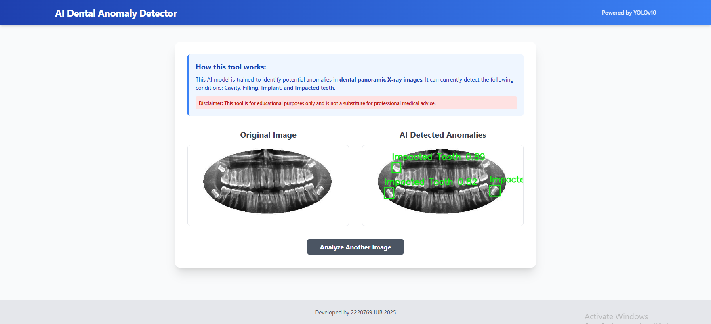

# 🦷 AI Dental Anomaly Detector

This is a **web-based application** that uses a **YOLOv10 machine learning model** to detect potential anomalies in **dental panoramic X-ray images**.

The application provides a simple, user-friendly interface for uploading an image and viewing the **AI-analyzed results** with bounding boxes drawn around detected issues.



## 🚀 Key Features

- **AI-Powered Detection**: Leverages a fine-tuned YOLOv10 model to identify dental anomalies
- **Supported Detections**: Trained to detect **Cavity, Filling, Implant, and Impacted Teeth**
- **Web Interface**: Clean, responsive, and easy-to-use interface built with **HTML, Tailwind CSS, and JavaScript**
- **Backend Server**: Lightweight **Node.js + Express** server for image uploads and processing
- **Side-by-Side Comparison**: Displays the **original** and **processed** images for clear analysis

## 🛠️ Technology Stack

- **Machine Learning**: Python, PyTorch, Ultralytics YOLOv10, OpenCV
- **Backend**: Node.js, Express.js
- **Frontend**: HTML, Tailwind CSS, JavaScript, SweetAlert2

## 📂 Dataset

This project was trained on the **Dental Radiography for Anomaly Detection** dataset available on Kaggle.

🔗 [Dental Radiography on Kaggle](https://www.kaggle.com/datasets/imtkaggleteam/dental-radiography)

## ⚙️ Getting Started

Follow these steps to set up and run the project on your local machine.

### Prerequisites

Make sure you have the following installed:

- [Git](https://git-scm.com/)
- [Node.js (with npm)](https://nodejs.org/)
- [Python 3.9+](https://www.python.org/downloads/)

### 🔧 Setup & Installation

#### Step 1: Clone the Repository

```bash
git clone https://github.com/MustaqueemAlam/dental-detector-app.git
cd dental-detector-app
```

#### Step 2: Add Model Files

Place your trained model files into the model_files directory:

```plaintext
dental_yolov10_best.pt
class_mapping.pkl
```

The final structure should look like this:

```plaintext
/dental-detector-app/
├── 📂 model_files/
│   ├── dental_yolov10_best.pt
│   └── class_mapping.pkl
...
```

#### Step 3: Set Up the Python Environment

Create a virtual environment:

```bash
# Create virtual environment
python -m venv venv

# Activate virtual environment
# On Windows:
.\venv\Scripts\activate
# On macOS/Linux:
source venv/bin/activate

# Install dependencies
pip install -r python_inference/requirements.txt
```

#### Step 4: Set Up the Node.js Server

```bash
# Install Node.js dependencies
npm install
```

### Running the Application

1. Ensure the Python virtual environment is active
2. Start the server:

```bash
node server.js
```

1. Open [http://localhost:7000](http://localhost:7000) in your browser

### How to Use

1. Navigate to [http://localhost:7000](http://localhost:7000)
2. Upload a dental panoramic X-ray image
3. Click "Diagnose Image"
4. View results showing original and processed images with detected anomalies

## ⚠️ Disclaimer

This is an educational project and is not intended for real-world medical diagnosis. The AI model's predictions are not a substitute for professional medical advice from a qualified healthcare provider.
